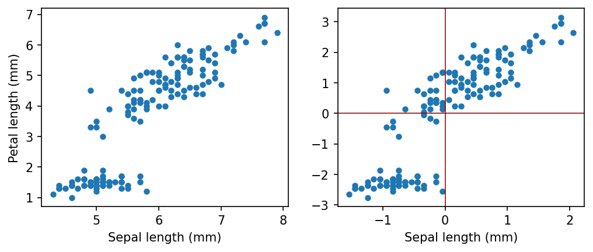

Principal Component Analysis (PCA) is a technique to reduce the dimensionality
of a dataset. It helps us to simply a given problem with the loss of minimum
possible information. We will see that when we work with high dimensional data
such as images, it is important to reduce the dimensionality of the problem both
for simplification and computational purpose at the same time without much
compromise in the end result.

Let us consider the following example. We have a set of two dimensional data,
where x component has 10 times more variation compared to y component. The
question is: can we ignore y component for simplicity?

```python
import numpy as np
import matplotlib.pyplot as plt
%matplotlib inline
plt.rcParams["figure.dpi"] = 150
plt.rcParams["figure.facecolor"] = "white"

# create some random data
x = 10 * np.random.randn(25)
y = np.random.randn(25)
y2 = np.zeros(25)

plt.figure(figsize = (8, 3))

plt.subplot(121)
plt.plot(x, y, "o", markersize=4)
plt.axvline(c="darkred", lw=0.75)
plt.axhline(c="darkred", lw=0.75)
plt.xlabel("x")
plt.ylabel("y")
plt.xlim(-20, 20)
plt.ylim(-20, 20)

plt.subplot(122)
plt.plot(x, y2, "o", markersize=4)
plt.axvline(c="darkred", lw=0.75)
plt.axhline(c="darkred", lw=0.75)
plt.xlabel("x")
plt.xlim(-20, 20)
plt.ylim(-20, 20)

plt.show()
```


### Centering of data

In most cases we will transform our data with zero mean. It is always possible
without losing any information.

$$x' = x - \bar{x}$$

Let us consider some real world data, and how we can center.

```python
import numpy as np
from sklearn import datasets
import matplotlib.pyplot as plt
%matplotlib inline
plt.rcParams["figure.dpi"] = 150
plt.rcParams["figure.facecolor"] = "white"

iris = datasets.load_iris()
data = iris.data

# data[:4, :]
# iris.feature_names

sepal_length = data[:, 0]
petal_length = data[:, 2]

sepal_length_centered = sepal_length - np.mean(sepal_length)
petal_length_centered = petal_length - np.mean(petal_length)

plt.figure(figsize = (8, 3))

plt.subplot(121)
plt.plot(sepal_length, petal_length, "o", markersize=4)
plt.xlabel("Sepal length (mm)")
plt.ylabel("Petal length (mm)")

plt.subplot(122)
plt.plot(sepal_length_centered, petal_length_centered, "o", markersize=4)
plt.axvline(c="darkred", lw=0.75)
plt.axhline(c="darkred", lw=0.75)
plt.xlabel("Sepal length (mm)")

plt.show()
```



### First Principal Component
A straight line, which is passing through the origin and the projections of the
centered coordinates of initial objects on which have the largest sample
variance, is called the **first principal component**.

A unit directional vector $\phi_1$ of the first principal component is called
the **loading vector of the first principal component**.

**A score vector of the first PC** is a column vector $Z_1$ of the form

$$
Z_1 = \begin{pmatrix} Z_{11} \\ Z_{12} \\ \vdots \\ Z_{1n} \end{pmatrix}
$$

consisting of the projections of the centered input data coordinates onto the
loading vector fo the first principal component.

How to find the first principal component?

$$
\arg\max\limits_{\phi_1} \bigg( \frac{1}{n} \sum \limits_{i=1}^n Z_{i1}^2 \bigg)
$$

We can find the subsequent principal components orthogonal to the previous ones
which makes sure that the principal components are not correlated.

### Notebooks

- [PCA Introduction](
https://github.com/pranabdas/machine-learning/blob/master/notebooks/pca-introduction.ipynb)
- [Principal Component Analysis on Iris dataset](
https://github.com/pranabdas/machine-learning/blob/master/notebooks/07-pca-iris-dataset.ipynb)
- [Principal Component Analysis on MNIST dataset](
https://github.com/pranabdas/machine-learning/blob/master/notebooks/08-pca-mnist-dataset.ipynb)
