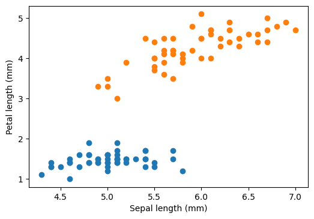

Support Vector Machine (SVM) is a technique used for binary classification. Let
us consider a categorical data:
```python
from sklearn import datasets
import matplotlib.pyplot as plt

%matplotlib inline
plt.rcParams["figure.dpi"] = 100
plt.rcParams["figure.facecolor"] = "white"

iris = datasets.load_iris()
data = iris.data

# data[:4, :]
# iris.feature_names
# iris.target

sepal_length = data[:, 0]
petal_length = data[:, 2]

# here we will pick two categories, the dataset has three differnt target values
plt.scatter(sepal_length[iris.target == 0], petal_length[iris.target == 0])
plt.scatter(sepal_length[iris.target == 1], petal_length[iris.target == 1])
plt.xlabel("Sepal length (mm)")
plt.ylabel("Petal length (mm)")
plt.show()
```



The question is: how can we draw a boundary (here a straight line in two
dimensional plane) that separates two categorical data. On an $n$-dimensional
dataset, we will have a $(n-1)$ dimensional hyperplane separating the two
categories.

$$l : b + w_1 x_1 + w_2 x_2 + \dots + w_{n-1} x_{n-1} = 0$$

where $w_1^2 + w_2^2 + \dots + w_{n-1}^2 \neq 0$

### Perceptron

First, let us have a look at the perceptron algorithm. This algorithm finds a
linear separator based on Stochastic Gradient Descent. Say we start with an
arbitrary line: $w \cdot x + b = 0$ ($w$ and $b$ are parameters), and say our
labels $y \in \{-1, +1\}$. Our line should separate our training data points in
two parts. The points on one side is $+1$ and on the another $-1$. What could be
a suitable loss function? Of course, there are many possibilities. One simple
possibility could be, we calculate $w \cdot x + b$, if we are right (i.e.,
predicts the correct label or $y(w \cdot x + b) > 0$), there is no loss. If we
are wrong, we assign loss = $w \cdot x + b$.


Our loss function is convex. We reach for solution by starting with an arbitrary
$w$ and $b$, then we go through our data sets and calculate $y(w \cdot x + b) >
0$. If we are right, there is no loss and no update to our $w$ and $b$. If we
are wrong, we change $w$ and $b$ along the negative gradient (Stochastic
Gradient Descent) by following amount:

$$w \rightarrow w  + \eta yx$$

$$b \rightarrow b + \eta y$$

where $\eta$ is the step size (learning rate), we could even consider it equal
to 1 for simplicity.

We follow this perceptron rule for all data points (called epoch), and start a
new epoch by going through the data again. The data points are shuffled before
each epoch. Once there are no more updates after going through all the data
points, we have reached the solution. If the dataset is linearly separable,
perceptron algorithm is guaranteed to find a solution. Notice that the learning
process is stochastic, it will produce different outcome each time (albeit each
solution will correctly classify our linearly separable dataset).

```python
from sklearn.linear_model import Perceptron
model = Perceptron(random_state=np.random.randint(100))

# choose the data only for category 0 and 1 (i.e., < 2)
# here tile creates 4 columns out of single boolean column
# later reshape is necessary as it returns a one dimensional array
data_copy = np.reshape(data[np.tile(np.array([iris.target < 2]).transpose(), \
            (1, 4))], (-1, 4))

# choose only sepal length and petal length cols
X = np.array([data_copy[:, 0], data_copy[:, 2]]).T
y = iris.target[iris.target < 2]

model.fit(X, y)

# get the separating hyperplane
w = model.coef_[0]
a = -w[0] / w[1]
xx = np.linspace(min(X[:, 0]), max(X[:, 0]))
yy = a * xx - (model.intercept_[0]) / w[1]

plt.scatter(sepal_length[iris.target == 0], petal_length[iris.target == 0])
plt.scatter(sepal_length[iris.target == 1], petal_length[iris.target == 1])
plt.plot(xx, yy)
plt.xlabel("Sepal length (mm)")
plt.ylabel("Petal length (mm)")
plt.show()
```


### Hard margin

We can see that there are many possible straight lines that perfectly separates
our training data points. Then which one to choose? We will pick the one which
will have maximum margin. Margin is the distance between the separator line and
nearest points on each side. The separator depends only on the points over the
margins, and hence the naming support vectors.

```python
from sklearn.svm import SVC

model = SVC(kernel='linear', C=1000)
model.fit(X, y)

# get the separating hyperplane
w = model.coef_[0]
a = -w[0] / w[1]
xx = np.linspace(min(X[:, 0]), max(X[:, 0]))
yy = a * xx - (model.intercept_[0]) / w[1]

# plot the parallels to the separating hyperplane that pass through the
# support vectors (margin away from hyperplane in direction
# perpendicular to hyperplane). This is sqrt(1+a^2) away vertically in
# 2-d.
margin = 1 / np.sqrt(np.sum(model.coef_ ** 2))
yy_down = yy - np.sqrt(1 + a ** 2) * margin
yy_up = yy + np.sqrt(1 + a ** 2) * margin

plt.scatter(sepal_length[iris.target == 0], petal_length[iris.target == 0])
plt.scatter(sepal_length[iris.target == 1], petal_length[iris.target == 1])
plt.plot(xx, yy_down, "--")
plt.plot(xx, yy_up, "--")
plt.plot(xx, yy)
plt.xlabel("Sepal length (mm)")
plt.ylabel("Petal length (mm)")
plt.show()
```


### Soft margin
What happens when the data is not linearly separable? Or even we might want to
maximize the margin by giving up some data point (which might well be outliers)?

### Kernel methods
How do we approach the problem when the data does not represent classes with
linear boundary? One of the methods is to expand the data into a higher order
space, and then use the linear boundary methods such as SVM. For example, in
case of quadratic boundary, we can expand extra basis vectors such as $x_1^2$,
$x_2^2$,..., $x_1 x_2$, $x_2 x_3$, ... along with feature space the $x_1$,
$x_2$, ... In such a higher dimension, the boundary is linear (though it is
quadratic or higher order polynomial in actual feature space).

### Notebooks

- [SVM Introduction](
https://github.com/pranabdas/machine-learning/blob/master/notebooks/svm-introduction.ipynb)

### Resources
- <https://jakevdp.github.io/PythonDataScienceHandbook/05.07-support-vector-machines.html>
- <https://scikit-learn.org/stable/modules/svm.html>
- <https://scikit-learn.org/stable/modules/generated/sklearn.svm.SVC.html>
